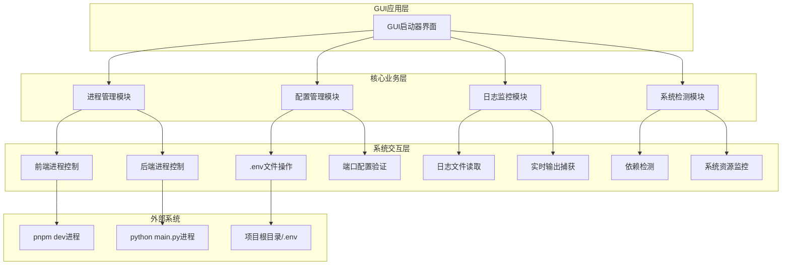
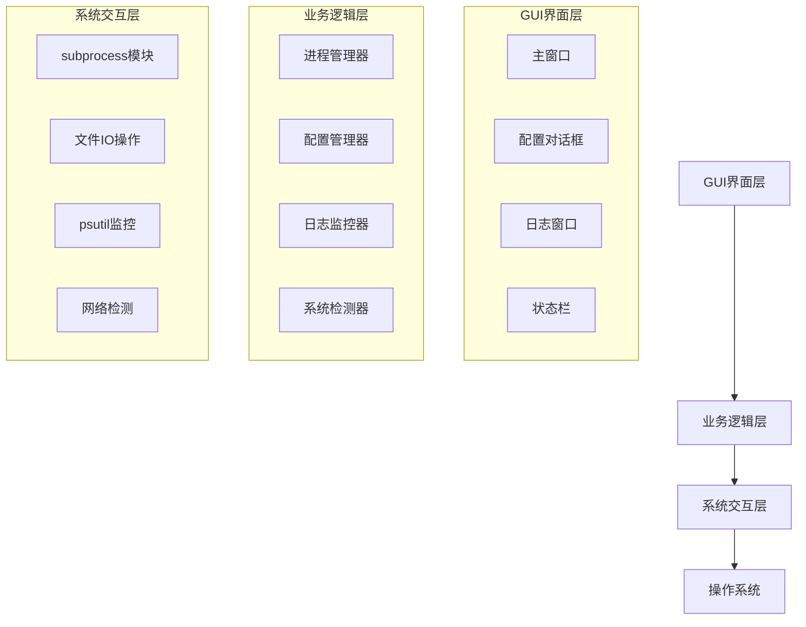
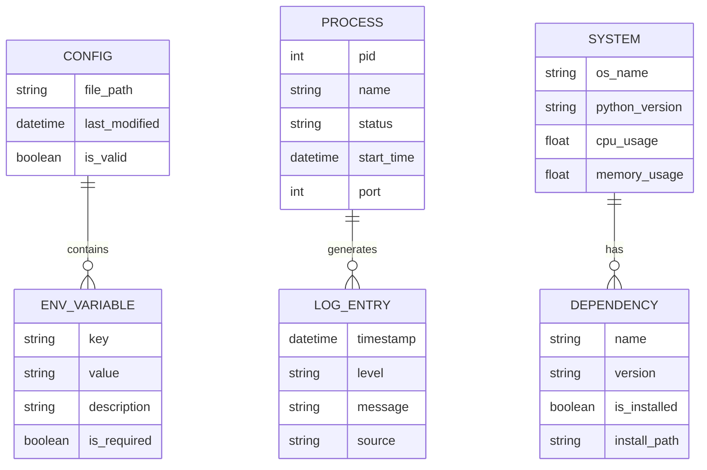

## 1. Architecture design



## 2. Technology Description

* Frontend: Python\@3.8+ + tkinter (内置GUI库)

* Backend: 无独立后端，直接与系统进程交互

* Process Management: subprocess + psutil

* File Operations: configparser + pathlib

* System Monitoring: psutil + platform

## 3. Route definitions

| Route   | Purpose                |
| ------- | ---------------------- |
| /       | 主控制台页面，显示项目启动控制和状态监控   |
| /config | 配置管理页面，提供端口配置和.env文件编辑 |
| /logs   | 日志监控页面，实时显示前后端运行日志     |
| /system | 系统信息页面，显示环境检查和资源监控     |

## 4. API definitions

### 4.1 Core API

进程管理相关

```python
class ProcessManager:
    def start_frontend() -> ProcessResult
    def start_backend() -> ProcessResult
    def stop_process(pid: int) -> bool
    def get_process_status(pid: int) -> ProcessStatus
```

参数定义:

| Param Name | Param Type | isRequired | Description |
| ---------- | ---------- | ---------- | ----------- |
| pid        | int        | true       | 进程ID        |

返回值:

| Param Name | Param Type | Description |
| ---------- | ---------- | ----------- |
| success    | boolean    | 操作是否成功      |
| pid        | int        | 进程ID        |
| status     | string     | 进程状态        |

配置管理相关

```python
class ConfigManager:
    def read_env_file() -> Dict[str, str]
    def write_env_file(config: Dict[str, str]) -> bool
    def validate_port_config(ports: Dict[str, int]) -> ValidationResult
```

参数定义:

| Param Name | Param Type      | isRequired | Description |
| ---------- | --------------- | ---------- | ----------- |
| config     | Dict\[str, str] | true       | 环境变量配置字典    |
| ports      | Dict\[str, int] | true       | 端口配置字典      |

返回值:

| Param Name | Param Type | Description |
| ---------- | ---------- | ----------- |
| valid      | boolean    | 配置是否有效      |
| errors     | List\[str] | 错误信息列表      |

日志监控相关

```python
class LogMonitor:
    def get_realtime_logs(service: str) -> Iterator[str]
    def search_logs(keyword: str, service: str) -> List[LogEntry]
    def export_logs(service: str, filepath: str) -> bool
```

参数定义:

| Param Name | Param Type | isRequired | Description            |
| ---------- | ---------- | ---------- | ---------------------- |
| service    | string     | true       | 服务名称(frontend/backend) |
| keyword    | string     | true       | 搜索关键词                  |
| filepath   | string     | true       | 导出文件路径                 |

系统检测相关

```python
class SystemDetector:
    def check_dependencies() -> List[DependencyStatus]
    def get_system_resources() -> SystemResources
    def check_port_availability(port: int) -> bool
```

参数定义:

| Param Name | Param Type | isRequired | Description |
| ---------- | ---------- | ---------- | ----------- |
| port       | int        | true       | 端口号         |

返回值:

| Param Name   | Param Type | Description |
| ------------ | ---------- | ----------- |
| available    | boolean    | 端口是否可用      |
| occupied\_by | string     | 占用进程信息      |

## 5. Server architecture diagram



## 6. Data model

### 6.1 Data model definition



### 6.2 Data Definition Language

配置文件结构 (.env)

```ini
# 通用端口配置
BACKEND_PORT=8483
FRONTEND_PORT=3015
VITE_FRONTEND_PORT=3015

# API配置
VITE_API_BASE_URL=http://127.0.0.1:8483
VITE_SCREENSHOT_BASE_URL=http://127.0.0.1:8483/static/screenshots

# 转写器配置
TRANSCRIBER_TYPE=fast-whisper
WHISPER_MODEL_SIZE=base

# Conda环境配置
CONDA_ENV_NAME=bilinote
```

进程状态数据结构

```python
@dataclass
class ProcessStatus:
    pid: int
    name: str
    status: str  # 'running', 'stopped', 'error'
    start_time: datetime
    cpu_percent: float
    memory_percent: float
    port: int
    
@dataclass
class SystemResources:
    cpu_usage: float
    memory_usage: float
    disk_usage: float
    network_status: bool
    
@dataclass
class DependencyStatus:
    name: str
    version: str
    is_installed: bool
    install_path: str
    required_version: str
```

日志条目数据结构

```python
@dataclass
class LogEntry:
    timestamp: datetime
    level: str  # 'INFO', 'WARNING', 'ERROR', 'DEBUG'
    message: str
    source: str  # 'frontend', 'backend', 'system'
    
@dataclass
class ValidationResult:
    is_valid: bool
    errors: List[str]
    warnings: List[str]
```

