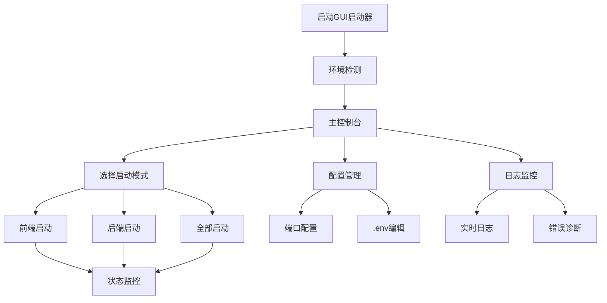

## 1. Product Overview

BiliNote GUI启动器是一个桌面应用程序，旨在为BiliNote AI视频笔记项目提供可视化的启动和管理界面。该工具将替代传统的命令行启动方式，为开发者和用户提供更直观、便捷的项目管理体验。

- 解决问题：简化BiliNote项目的启动流程，提供可视化的配置管理和状态监控
- 目标用户：BiliNote项目的开发者、部署人员和技术用户
- 产品价值：提升开发效率，降低项目部署和管理的技术门槛

## 2. Core Features

### 2.1 User Roles

| Role | Registration Method | Core Permissions |
|------|---------------------|------------------|
| 项目管理员 | 直接使用，无需注册 | 完整的配置管理、启动控制和状态监控权限 |

### 2.2 Feature Module

我们的BiliNote GUI启动器包含以下主要页面：

1. **主控制台页面**：项目启动控制、状态监控、快速操作面板
2. **配置管理页面**：端口配置、.env文件编辑、环境变量管理
3. **日志监控页面**：实时日志查看、错误诊断、性能监控
4. **系统信息页面**：环境检查、依赖状态、系统资源监控

### 2.3 Page Details

| Page Name | Module Name | Feature description |
|-----------|-------------|---------------------|
| 主控制台页面 | 启动控制面板 | 提供前端、后端的独立启动/停止按钮，支持一键同时启动，显示当前运行状态和PID信息 |
| 主控制台页面 | 状态监控面板 | 实时显示前后端服务状态（运行中/已停止），端口占用情况，进程健康状态 |
| 主控制台页面 | 快速访问面板 | 提供前端访问链接(http://localhost:5173)，后端API访问链接(http://localhost:8483)，项目文档链接 |
| 配置管理页面 | 端口配置模块 | 可视化编辑BACKEND_PORT、FRONTEND_PORT、VITE_FRONTEND_PORT等端口配置，支持配置验证和冲突检测 |
| 配置管理页面 | .env文件编辑器 | 内置文本编辑器查看和修改.env文件，支持语法高亮、配置项分类显示、一键恢复默认配置 |
| 配置管理页面 | 环境变量管理 | 管理CONDA_ENV_NAME、TRANSCRIBER_TYPE、WHISPER_MODEL_SIZE等关键配置项 |
| 日志监控页面 | 实时日志查看 | 分别显示前端和后端的启动日志，支持日志过滤、搜索、导出功能 |
| 日志监控页面 | 错误诊断 | 自动识别常见错误（端口占用、依赖缺失、环境问题），提供解决建议 |
| 系统信息页面 | 环境检查 | 检测Python、Node.js、pnpm、conda、ffmpeg等依赖的安装状态和版本信息 |
| 系统信息页面 | 系统资源监控 | 显示CPU、内存使用情况，磁盘空间，网络状态等系统信息 |

## 3. Core Process

### 主要用户操作流程

**项目启动流程：**
1. 用户打开GUI启动器
2. 系统自动检测环境和配置状态
3. 用户选择启动模式（前端/后端/全部）
4. 系统执行启动命令并显示实时状态
5. 启动完成后提供访问链接

**配置管理流程：**
1. 用户进入配置管理页面
2. 查看当前.env配置或修改端口设置
3. 系统验证配置有效性
4. 保存配置并提示重启服务

**故障排查流程：**
1. 系统检测到启动失败或运行异常
2. 自动分析日志和错误信息
3. 提供诊断结果和解决建议
4. 用户根据建议修复问题

## 4. User Interface Design

### 4.1 Design Style

- **主色调**：深蓝色(#1e3a8a)作为主色，浅蓝色(#3b82f6)作为辅助色
- **按钮样式**：圆角矩形按钮，支持悬停和点击状态变化
- **字体**：微软雅黑 14px（标题），12px（正文），10px（状态信息）
- **布局风格**：左侧导航栏 + 右侧内容区域的经典布局，顶部状态栏显示全局信息
- **图标风格**：使用Material Design风格的图标，支持启动、停止、配置、日志等操作

### 4.2 Page Design Overview

| Page Name | Module Name | UI Elements |
|-----------|-------------|-------------|
| 主控制台页面 | 启动控制面板 | 大型启动按钮(绿色)、停止按钮(红色)、重启按钮(橙色)，状态指示灯(绿/红/黄)，进程PID显示 |
| 主控制台页面 | 状态监控面板 | 实时状态卡片，端口占用表格，服务健康度进度条，最近操作历史列表 |
| 配置管理页面 | 端口配置模块 | 数字输入框，端口冲突警告提示，配置保存按钮，一键重置按钮 |
| 配置管理页面 | .env文件编辑器 | 代码编辑器组件，语法高亮，行号显示，搜索替换功能，保存/撤销按钮 |
| 日志监控页面 | 实时日志查看 | 分屏显示前后端日志，自动滚动，日志级别过滤器，清空日志按钮 |
| 系统信息页面 | 环境检查 | 依赖检查列表，版本信息表格，状态图标(✓/✗)，刷新检测按钮 |

### 4.3 Responsiveness

该产品为桌面应用程序，主要针对Windows系统设计，最小窗口尺寸为1024x768，支持窗口缩放和最大化。界面采用响应式布局，在不同窗口尺寸下自动调整组件大小和排列方式。